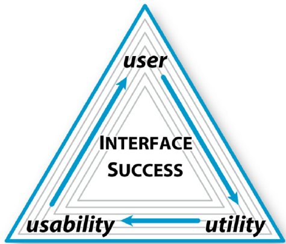

# Ogham in 3d
***

The aim of this website is to create a repository for a local community digital archaeology project. A group of volunteers, with the help of Dublin Institute of Advanced Studies and The Discovery Programme conducted a series of 3d mapping, starting with ogham stones, and moving onto other ancient antiquities, on the Dingle Peninsula. They are using Structure from Motion, a technique to create a 3-D structure of a scene from a set of 2-D images (photos). This website is the beginning of a digital archive of the research carried out.

View deployed site here: https://orlabr.github.io/ogham-mapping-project/index.html

## Table of Contents:

- [Project outline](#project-outline)
- [User Experience](#user-experience)
- [Design](#design)
- [Features](#features)
- [Technologies](#technologies)
- [Testing](#testing)

## 

***

## Project Outline :black_nib:
This website has a dual purpose. It was created as a digital archive to showcase some of the Ogham Stones the project has been looking into, their location, information about the stone, and incorporate the 3d mapped scan.\\
It also deploys all my course learning to date with the Code Institute. The elements I used in creating this website, are all practical techniques I have been learning,  working through the Interactive Front End Development modules of the Full Stack Developer Bootcamp.\\

## User Experience :busts_in_silhouette:
---
### Research:
Before starting my UX research for this project, I did some research on creating ‘Interactive Maps’ and found lots of great websites and articles, (links and further reading below).
Making Maps -  is a blog about diy cartography. Based on the  book Making Maps 3nd edition. It has some excellent blog posts about creating maps
Robert E. Roth has written many papers on creating interactive maps. I particularly liked his work explaining The Three U’s of Interface Success. A successful interactive map in practice is contingent upon three components: the user, its utility, and its usability.
Victor Gerard Temprano of Mapster has written some great articles too, on creating Interactive Maps. One particular article describes the user in detail, and this influenced my user story and design...“Don't assume your users will know how to use an online map...You need to consider how your grandmother (no offense to techie grandmas!) might react if she landed on the map. Where would she look, what would she click and be interested in?”

---
### User Stories:

* The website is a digital public archive of the research carried out by volunteers of ‘Corca Dhuibhne 3d, a pilot community digital archaeology project to 3d map Ogham stones on the Dingle Peninsula. It holds some of  the research carried out by volunteers, as well as a map of the stones that have been scanned.

* There is already a website, run by the Dublin Institute of Advanced Studies of research they have conducted across Ireland, with archival information, and a map of ancient antiquities they have 3d scanned. There is also a website created for the ancient antiquities that have been scanned called ‘Corca Dhuibhne 3d’. However both of the websites are more academic based, and not particularly user friendly. The Ogham in 3d map on the DIAS website is quite annoying to use, if you are looking for stones particular to the Dingle Peninsula. It doesn’t focus on the stones, provides links to other pages but with no backlinks to the map. And you constantly have to zoom in on the map, to get to the stones, in order to pick one in particular. The Corca Dhuibhne 3d website is particular to the pilot project, but does not contain a map, and is also not user friendly, proving too much academic style information to the average viewer. This website I have designed, is harnessing the information from both the existing websites, but in a more modern, responsive style, that will appeal to participants of the project, but also to a generic user. It is an experiment in presenting blocks of information in a minimal way.

_For the Generic User:_
            I designed this website with a particular type of user. The user is aged 60+, holidaymaker or retired, with a keen interest in local history, and while visiting the Dingle Peninsula, would like to know more about local sites. They have limited digital knowledge and experience, but have researched and prepared for their holiday. They have read about the Dingle Peninsula's wealth of history and ancient antiquities, came across this website and have studied and bookmarked it to view when they reach their destination. They want to see some ogham stones. They have looked and marvelled at the 3d scans of the stones and have picked which ones they want to visit, which they can perfectly locate on the map. They used the website in two ways:
	* research of local sites of interest on the Dingle Peninsula before visiting - desktop or tablet viewing. Reading about the stones and viewing the 3d models
	* actual location of the stones while on the peninsula - mobile view

_Developer:_
            As a developer, I wanted to create a fully responsive website with a clean modern take on digital archiving. As a history fan I regularly visit online digital archives, but find a lot of them usually feel heavy and clunky, too academic focused, and are not mobile friendly.
* This website would help me practice my new coding skills, develop logic and understanding of responsive interactive front end development.
* Development of coding skills using HTML, CSS and Javascript in unison, and in different ways to create a website that is simple, extremely user friendly, with easy navigation, and yet capable of providing large bodies of information.
---
#### Strategy & Scope:
The website is designed to have a minimal and clean interface. With most of the information contained in just one scrollable page. I selected 10 stones to work with. If I was using more stones, I probably would move to a slightly different format, using more pages, but for the purpose of this project, I kept it to a minimal amount. The website uses a single index.html file to host most of the information, using the Bootstrap Framework to ensure mobile first fully responsive design.

_Style:_
Design - minimalist, clean design
Fonts - I used Google Fonts to personalize the text. Most sites when discussing ‘Celtic’ antiquities use a ‘celtic style font, however I don’t think it looks great on a web page, particularly mobile. I chose ‘Aramath’ and ‘Forum’, as they are stylised but clean and readably fonts.
Color Scheme - The color scheme is simple, and kept to a minimum to ensure full eligibility. Off white background, dark text with headings and buttons a shade of brown. These browns are  based on colouring from old medieval maps.
    
_Photos and 3D Models:_
The Corca Dhuibhne 3d models were created by volunteers, using an educational copy of Agisoft donated by the Discovery Programme. They are in the public domain, but are copyright to Corca Dhuibhne 3d group, of which I am a member. I have full permission to use the information, photos, and 3 models on my website, which I have listed as educational use. The ‘corca dhuibhne 3d website is currently under review, and I am hoing to incorporate some of the elements of this website and the map into the website.
---
#### Structure, Skeleton & Skeleton:
Keeping the pyramid of interface success, user - utility- usability, and my user story in mind, simplicity and ease of use were the most important design elements, when creating the wireframe and mock up. Keeping images to a minimum, with simple explainiations of how to use the site, with a very deliberate colour scheme and simple fonts.

_Wireframing:_
I created a wireframe for this website using Balsamiq, but found the original design, using a bootstrap collapsible sidebar did not work well on mobile. The design only worked in landscape view on a mobile, and to me this meant it was not fully responsive. So I changed the layout to have a collapsible accordion bootstrap style beneath the map.

_Detailed mockup_
After I had started the project, and realised the fault of the wireframe design, I edited my design using Canva, to create a more detailed mock up of the website. This enabled me to test the details such as fonts, imagery etc, in more detail.

[Back to Top](#table-of-contents) 
---
## Features :ledger:

#### Existing Features
 - *Google Maps API* - incorporate a fully functioning Google Map with locations of ogham stones. Personalized infor window with image and link to further information.
 - *Contact Form* - Simple contact form to connect the project for information
 - Embedded iframes - styled iframes from online platform 'Sketchfab'

## Technologies Used :paperclip:
 - Programming languages used: HTML, CSS & Javascript 
 - Frameworks used: <a href="https://getbootstrap.com/"> Bootstrap Framework</a> ~ 
 - Editors used:
	* <a href="https://repl.it">Repl</a> ~ I used Repl to write and test code snippets. This is helping me build up a personal library of code snippets and hacks that I can use in different projects in the future.
	* <a href="https://gitpod.com">Gitpod</a> ~ I used Gitpod to build the full website. 
 - Hosting: <a href="https://github.com">Github</a> ~ Github is where I am hosting my deployed website
 - Frameworks ~ <a href="https://getbootstrap.com/">Bootstrap</a> 
 - API ~ <a href="https://developers.google.com/maps/documentation">Google Maps Platform</a> 
 - iFrames ~ using <a href="https://sketchfab.com">Sketchfab embedded iframe, manipulated through CSS

*Other web applications used:*
- <a href="https://balsamiq.com/">Balsamiq<a/> - to create initial wireframe
- <a href="https://www.canva.com/">Canva<a/> - to create a detailed mock-up
- <a href="https://www.adobe.com/">Adobe Photoshop<a/> - to edit the photographs
- <a href="https://fonts.google.com/">Google Fonts<a/> - sytlesheet linked to customize fonts
- <a href="https://fontawesome.com/">Font Awesome<a/> - stylesheet linked to custimize icons
- <a href="https://www.emailjs.com//">EmailJS<a/>- create usable contact form
---
## Testing: :wrench:
_Dev Tools_:
These tools were used throughout the project build.
* Google Chrome DevTools ~ used throughout the project for testing and debugging
* Firebox Firebug ~ used throughout the project for testing and debugging

_Code Validation:_
I used  few online validators and formatters to check the code at regular intervals throughout the build.
         - <a href="https://validator.w3.org/">W3C HTML Validator</a> 
         - <a href="https://validator.w3.org/">W3C CSS Validator</a> 
         - <a href="https://jshint.com/">JSHint</a> 
         - <a href=”https://esprima.org/demo/validate.html”>Esprima Syntax Validator</a>

[Back to Top](#table-of-contents)

